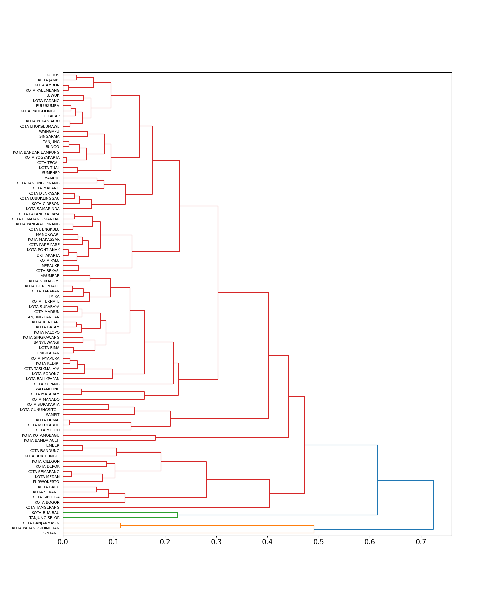
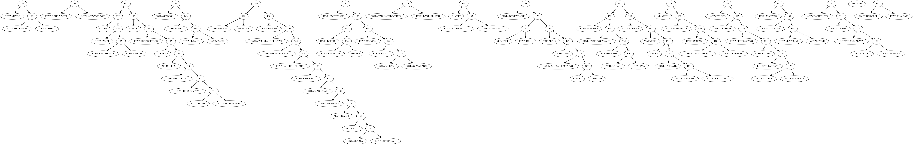
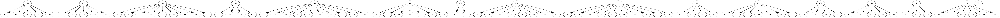

[//]: # (# **IMPORTANT**)

[//]: # ()
[//]: # (This repository is not being maintained anymore. The code was split into two new repositories:)

[//]: # (- Source Code: https://github.com/caponetto/bayesian-hierarchical-clustering)

[//]: # (- Examples: https://github.com/caponetto/bayesian-hierarchical-clustering-examples)

[//]: # ()
[//]: # (---)

[//]: # (![Python application]&#40;https://github.com/caponetto/bhc/workflows/Python%20application/badge.svg&#41; )

[//]: # ([![License: GPL v3]&#40;https://img.shields.io/badge/License-GPLv3-blue.svg&#41;]&#40;https://www.gnu.org/licenses/gpl-3.0&#41;)

[//]: # ([![GitHub Stars]&#40;https://img.shields.io/github/stars/caponetto/bhc.svg&#41;]&#40;https://github.com/caponetto/bhc/stargazers&#41;)

[//]: # ([![GitHub Forks]&#40;https://img.shields.io/github/forks/caponetto/bhc.svg&#41;]&#40;https://github.com/caponetto/bhc/network/members&#41;)

[//]: # (1. )

[//]: # (2. Create an anaconda environment using the file [environment.yml]&#40;environment.yml&#41;.)

[//]: # ()
[//]: # (    `$ conda env create -f environment.yml`)

[//]: # ()
[//]: # (2. Activate the environment after the installation is completed.)

[//]: # ()
[//]: # (    `$ conda activate bayesian-hierarchical-clustering`)

[//]: # ()
[//]: # (3. Run the file [example.py]&#40;example.py&#41;.)

[//]: # ()
[//]: # (    `$ python example.py`)

[//]: # ()
[//]: # (4. Check out the output images in the [results]&#40;results/&#41; folder.)

[//]: # ()
[//]: # (**Note**: You can optionally add your own data in the file [data.csv]&#40;data/data.csv&#41; but the hyperparameters must be optimized.)

[//]: # (## What to expect from the example code)

[//]: # (A plot of the input data &#40;2D&#41;. Suppose we want to find two clusters of data &#40;orange and blue&#41;.)

[//]: # (
)

[//]: # (  )

[//]: # (
)
 
[//]: # (Dendrograms obtained from linkage algorithms. Notice that, none of them can tell us the presence of the two clusters.)

[//]: # (   )
[//]: # (   )
  

[//]: # (A binary hierarchy obtained from the Bayesian hierarchical clustering algorithm. Notice that, two clusters have been identified containing the expected data points &#40;leaves&#41;.)

   

[//]: # (A non-binary hierarchy obtained from the Bayesian rose trees algorithm. Notice that, two clusters have been identified containing the expected data points &#40;leaves&#41;.)

   

